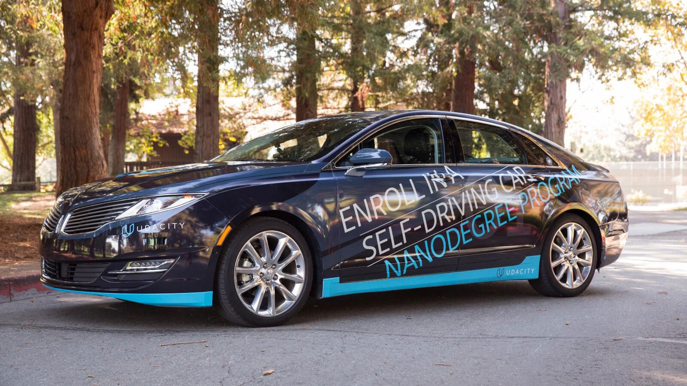
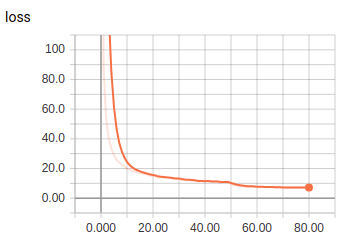
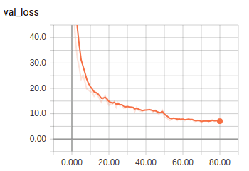

# Self Driving Car Nanodegree - Capstone Project: System Integration
[](http://www.udacity.com/drive)



## System Architecture
The following is a system architecture diagram showing the ROS nodes and topics used in the project.
The ROS nodes and topics shown in the diagram are described briefly in the **Code Structure** section below.


## Code Structure
Below is a brief overview of the repo structure, along with descriptions of the ROS nodes.

### Traffic Light Detection Node
This package contains the traffic light detection node: `tl_detector.py`.


See code in
[/ros/src/tl_detector/](https://github.com/hidetoshi-furukawa/CarND-Capstone/tree/master/ros/src/tl_detector/).

### Waypoint Updater Node
This package contains the waypoint updater node: `waypoint_updater.py`.


See code in [/ros/src/waypoint_updater/](https://github.com/hidetoshi-furukawa/CarND-Capstone/tree/master/ros/src/waypoint_updater/).

### Drive By Wire (DBW) Node
Carla is equipped with a drive-by-wire (dbw) system, meaning the throttle, brake, and steering have electronic control.
This package contains the files that are responsible for control of the vehicle: the node `dbw_node.py` and the file `twist_controller.py`.


See code in [/ros/src/twist_controller/](https://github.com/hidetoshi-furukawa/CarND-Capstone/tree/master/ros/src/twist_controller/).

## Traffic Light Detection
### Simulator
We use YOLOv3-tiny for traffic light detection and classification.

1. Download YOLOv3-tiny weight from [YOLO website](http://pjreddie.com/darknet/yolo/)
1. Convert the Darknet YOLO model to a Keras model.
1. Transfer learning for traffic light detection.

Graph of the YOLOv3-tiny model:
<!---->
<div class="test">

</div>

|Loss|Val Loss|
|:---|:---|
|||

## Original Instructions
This is the project repo for the final project of the Udacity Self-Driving Car Nanodegree: Programming a Real Self-Driving Car. For more information about the project, see the project introduction [here](https://classroom.udacity.com/nanodegrees/nd013/parts/6047fe34-d93c-4f50-8336-b70ef10cb4b2/modules/e1a23b06-329a-4684-a717-ad476f0d8dff/lessons/462c933d-9f24-42d3-8bdc-a08a5fc866e4/concepts/5ab4b122-83e6-436d-850f-9f4d26627fd9).

Please use **one** of the two installation options, either native **or** docker installation.

### Native Installation

* Be sure that your workstation is running Ubuntu 16.04 Xenial Xerus or Ubuntu 14.04 Trusty Tahir. [Ubuntu downloads can be found here](https://www.ubuntu.com/download/desktop).
* If using a Virtual Machine to install Ubuntu, use the following configuration as minimum:
  * 2 CPU
  * 2 GB system memory
  * 25 GB of free hard drive space

  The Udacity provided virtual machine has ROS and Dataspeed DBW already installed, so you can skip the next two steps if you are using this.

* Follow these instructions to install ROS
  * [ROS Kinetic](http://wiki.ros.org/kinetic/Installation/Ubuntu) if you have Ubuntu 16.04.
  * [ROS Indigo](http://wiki.ros.org/indigo/Installation/Ubuntu) if you have Ubuntu 14.04.
* [Dataspeed DBW](https://bitbucket.org/DataspeedInc/dbw_mkz_ros)
  * Use this option to install the SDK on a workstation that already has ROS installed: [One Line SDK Install (binary)](https://bitbucket.org/DataspeedInc/dbw_mkz_ros/src/81e63fcc335d7b64139d7482017d6a97b405e250/ROS_SETUP.md?fileviewer=file-view-default)
* Download the [Udacity Simulator](https://github.com/udacity/CarND-Capstone/releases).

### Docker Installation
[Install Docker](https://docs.docker.com/engine/installation/)

Build the docker container
```bash
docker build . -t capstone
```

Run the docker file
```bash
docker run -p 4567:4567 -v $PWD:/capstone -v /tmp/log:/root/.ros/ --rm -it capstone
```

### Port Forwarding
To set up port forwarding, please refer to the [instructions from term 2](https://classroom.udacity.com/nanodegrees/nd013/parts/40f38239-66b6-46ec-ae68-03afd8a601c8/modules/0949fca6-b379-42af-a919-ee50aa304e6a/lessons/f758c44c-5e40-4e01-93b5-1a82aa4e044f/concepts/16cf4a78-4fc7-49e1-8621-3450ca938b77)

### Usage

1. Clone the project repository
```bash
git clone https://github.com/udacity/CarND-Capstone.git
```

2. Install python dependencies
```bash
cd CarND-Capstone
pip install -r requirements.txt
```
3. Make and run styx
```bash
cd ros
catkin_make
source devel/setup.sh
roslaunch launch/styx.launch
```
4. Run the simulator

### Real world testing
1. Download [training bag](https://s3-us-west-1.amazonaws.com/udacity-selfdrivingcar/traffic_light_bag_file.zip) that was recorded on the Udacity self-driving car.
2. Unzip the file
```bash
unzip traffic_light_bag_file.zip
```
3. Play the bag file
```bash
rosbag play -l traffic_light_bag_file/traffic_light_training.bag
```
4. Launch your project in site mode
```bash
cd CarND-Capstone/ros
roslaunch launch/site.launch
```
5. Confirm that traffic light detection works on real life images
